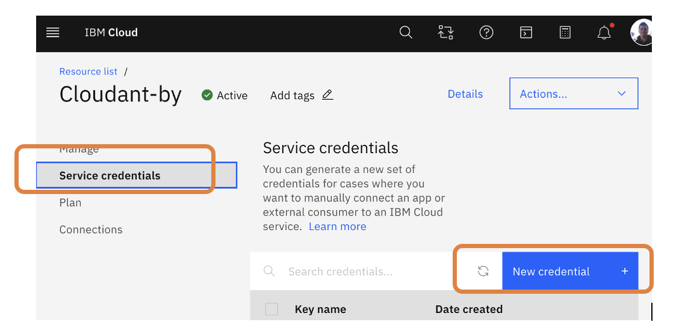

# IoT Lab with Node-RED

Welcome to this lab which is part of the Big Data module. 

## Introduction – Lab Scenario

You are an IoT engineer tasked with setting up a prototype to:
- Collect simulated sensor data via Node-RED and MQTT
- Store measurements in a time-series database (**InfluxDB**) and/or a NoSQL document store database (**CouchDB**)
- Create your first IoT application with condition-based rules.
- Create a dashboard to visualize this data in real time from Node-RED and from Grafana. 
- Use machine learning and generative AI to create your first predictive models from a time series dataset. 

The lab recommends a local installation of each component in containers (podman/docker) , but Cloud alternatives are also possible and presented in this guide. 

### Learning Tasks

- Install and use Node-RED locally or in Cloud mode.
- Create a virtual sensor and transmit its data via MQTT.
- Store IoT data in InfluxDB (time series).
- Store enriched events in CouchDB (JSON documents).
- Set up a real-time dashboard with Node-RED Dashboard.
- Explore Grafana for advanced visualization.
- Use your first LLM for timeseries prediction.

---

## Step 1 – Install and Start Node-RED

Node-RED (https://nodered.org/) is a flow-based programming tool, originally developed by the IBM Emerging Technology Services team in early 2013 and now a part of JS Foundation.
Traditional development can be very technical, but Node-RED enables you to concentrate on the logic of your workflow and allows fast prototyping.
Node-RED consists of a Node.js-based runtime with a flow editor accessed through a web browser. Within the browser, you create your application by dragging nodes from a customizable palette into a workspace and start to wire them together. With a single click, the application is deployed back to its runtime.

### Local Method (Recommended)

**Option 1: Native Installation (requires Node.js)**
```bash
# Install Node.js LTS from https://nodejs.org/en/download/
node -v
npm -v
# Install Node-RED
npm install -g --unsafe-perm node-red
# Start Node-RED
node-red
```
Interface: http://localhost:1880

**Option 2: Installation via Docker / Podman**
```bash
docker run -it -p 1880:1880 -v node_red_data:/data --name mynodered nodered/node-red
```

**Option 3: Cloud wiht NodeRED aa a service**
Create a free account on FlowFuse
__ 1.	Go to https://flowfuse.com/  and click on “GET STARTED FOR FREE” 
__ 2.	Fill in the Account Creation form. Use the appropriate email and personal information.
__3. Create a Node-RED instance and click “Open Editor”.


## Step 2 – Create a Virtual Sensor in Node-RED

1. Open the Node-RED interface.
2. Creation of an IoT Device simulator

- Add an inject, a function, and a debug or mqtt-out node.
- From left panel, drag and drop nodes to the workspace
•	Choose the Input node mqtt out  
•	Add an inject node output debug node , function node
•	Link them as shown below:


3. Configure inject to repeat every 5 seconds.

4. Configure the function node:


```javascript
msg.payload = { d: { temp: 28, humidity: 79, objectTemp: 24 } };
return msg;
```

5. Configure the MQTT node as shown: 
`Topic  "iot-2/cmd/YOURNAME/fmt/json" `
where YOURNAME is a unique identifier, your name for example.


6. Edit the MQTT Server part:
`Server: test.mosquitto.org`   
`Port: 1883`

7. Deploy and check in the Debug panel on the right side while you are playing with the sensor simulator. Every 5 seconds or each time you push the “Inject node” button, your node-red simulator is injecting and publishing a message to the MQTT broker.


8. IoT Application & MQTT Subscription:
8.1 Now import a new flow (flow1.json). A flow can be exported & imported using JSON file. [Flow1.json](./flow1.json)
8.2 Select all content and copy it (Ctrl-A, Ctrl-C)
8.2 Click on the top right button near Deploy. Select Import, Clipboard & copy/paste the content of the JSON file in Current flow.

8.3 Click on workspace to paste imported nodes. 
Check and adapt the mqtt In node settings (topic, mqtt settings).
Double click on the node, edit the topic and subscribe to the previously used topic

8.3 Click Deploy to deploy the new Flow. 
Modify the Device Temperature & check the Debug logs.


**Additional Exercise**
Generate a random temperature between 20 and 35°C. and observe results in the Debug Panel. Use [simulator_flow1.json](./simulator_flow1.json)


## Step 3 – Store IoT Data in CouchDB

### Install CouchDB
**Local Installation (recommended)**
```bash
docker run -d -p 5984:5984 -e COUCHDB_USER=admin -e COUCHDB_PASSWORD=password  --name couchdb couchdb
```
Interface Fauxton: http://localhost:5984/_utils
Create a database iotdb.

**Cloud Installation**
If you can't install CouchDB locally, it is possible to consume the service in the Cloud. IBM Cloud offers an enterprise version of CouchDB called Cloudant. Here are the steps to create an instance in the cloud. 
As a student or academic teacher, **IBM SkillsBuild** gives you access to many IBM Products and cool products in **SaaS** mode like **watxon** and **watsonx** AI services, Kubernetes services, Data services...

1)	Register with IBM SkillsBuild. Use your academic email address as an IBM ID whenever possible:  [Instructions](https://github.com/academic-initiative/documentation/blob/main/academic-initiative/how-to/How-to-register-with-the-IBM-Academic-Initiative/readme.md) 

2)	Create an IBM Cloud Account: [Instructions](https://github.com/academic-initiative/documentation/blob/main/academic-initiative/how-to/How-to-create-an-IBM-Cloud-account/readme.md)
3)	Request an IBM Cloud Feature Code: [Instructions](https://github.com/academic-initiative/documentation/tree/main/academic-initiative/how-to/How-to-request-and-IBM-Cloud-Feature-Code)
4) Apply an IBM Cloud Feature Code: [Instructions](https://github.com/academic-initiative/documentation/tree/main/academic-initiative/how-to/How-to-apply-an-IBM-Cloud-Feature-Code)
5) Create your CouchDB service
5.1 First, create a Cloudant service running in a Cloud to store your IoT data. Browse the catalog and instanciate a Cloudant service 

 

5.2 Use the default values and select the Lite (Free) plan a shown below. Push the Create button. 

5.3 Go to the “Resource List” page, click on your service


5.4 Service Credentials, New Credential



5.5 Note your credentials (apikey,url) for later


### Node-RED Connection to CouchDB
1. Install node-red-node-couchdb
We’ll need to interact with Cloudant from Node-RED. To do so, the easiest way is to install a cloudant Node-RED node. 
1.1 Go to the top right menu, click **Manage Palette**
1.2 Search and install `node-red-contrib-cloudantplus`  as shown below. Click the install button. This install should take a few seconds and you’ll be notified once done. 


2. Add a couchdb out node. 
Add a couchdb/Cloudant Node  (`Cloudant OUT` node in the Storage Category) & link it to the temp function node 


3. Configure the node to connect to your database by double clicking on the cloudant node (ensure you use a `cloudant out` node)


a_ : If using Cloudant db on IBM Cloud: use your service credentials obtained on the Cloudant servicen (API key, user password)


b_ if using local Couchdb, please enter the connection information as shown below


There are several ways to connect your NodeRED and the CouchDB containers together (podman network etc.). In this example, we use the IP address of the pod, obtained by running this simple command: 
```bash
podman inspect --format='{{.NetworkSettings.IPAddress}}' <containerName>
```
where containterName here is `couchdb`. Set the `Host` property to http://<IP>:5984  where `<IP>`is the result of the command above. 


4. Validate the configuration and deploy your flow:


**Insert JSON Data from your IoT device**

Test (push Inject node or wait if your inject node is configured to inject every x seconds.  Your iotdata node (Cloudant in should be “connected” to the cloudant cloud service as shown below: 


Check on your Cloudant service or with CouchDB locally using http://localhost:5984/_utils/#/ that you inserted your IoT document in the iotdb database.


## Step 4 – Store IoT Data in InfluxDB 

**CouchDB** is a NoSQL database that can be used to store all kinds of data, **[InfluxDB](https://github.com/influxdata/influxdb)** is a time series database (TSDB) built to collect, process, transform, and store event and time series data. Even if time series data can be stored in classic NoSQL (key-value store, or Document store like CouchDB) or even relational database systems, **TSDB** like **Prometheus** or **InfluxDB** are convenient when you want to store time series for performance and scalability reasons, the big data challenges that we must face in the IoT and generative AI era.

In a time series database, data points typically consist of successive measurements made from the same source and are used to track changes over time. Examples of time series data include:

   - Industrial sensor data,  **our use case here!**
   - Server performance metrics
   - Heartbeats per minute
   - Rainfall measurements
   - Stock prices

Before you get started using InfluxDB, it’s important to understand how time series data is organized and stored in InfluxDB and some key definitions that are used throughout this documentation.
Data organization

The InfluxDB data model organizes time series data into buckets and measurements. A bucket can contain multiple measurements. Measurements contain multiple tags and fields.
- `Bucket`: Named location where time series data is stored. A bucket can contain multiple measurements.
- `Measurement`: Logical grouping for time series data. All points in a given measurement should have the same tags. A measurement contains multiple tags and fields.
- `Tags`: Key-value pairs with values that differ, but do not change often. Tags are meant for storing metadata for each point–for example, something to identify the source of the data like host, location, station, etc.
- `Fields`: Key-value pairs with values that change over time–for example: temperature, pressure, stock price, etc.
- `Timestamp`: Timestamp associated with the data. When stored on disk and queried, all data is ordered by time.

To interact with InfluxDB in this lab, we'll use Node-RED specific node that uses HTTP API to interact with the database, as well as the InfluxDB web User Interface (UI). 

**Local Installation**
```bash
# Via Docker or podman
docker run -d -p 8086:8086 --name influxdb influxdb:2.7
```
Interface: http://localhost:8086
Configure: Organization, Bucket (iotbucket), Token.


**Cloud Alternative**
Create an InfluxDB Cloud account https://cloud2.influxdata.com/signup
Create a bucket + generate a token.

**Node-RED Connection to InfluxDB**
1. Install node-red-contrib-influxdb (Menu > Manage Palette > Install node)

2. Add an influxdb out node to your flow


3. Configure the node as shown below

 

 where the IP address above corresponds to the container ip address.
 ```bash
 podman inspect --format='{{.NetworkSettings.IPAddress}}' influxdb
 10.88.0.14
 ```

**Data Insertion**

Let's use InfluxDB to store our iot time series data from the sensors. Connect the `MQTT in` node (Subscribe) to a new `function` node, and this `function` node to the `Influx DB Out` node 

Copy and paste the javascript below in the `function`node: 
```javascript
var json = msg.payload.d;
msg.payload = [ json,
{
    tag1: "sensor1",
    tag2: "device2"
}];

return msg;
```
**Check your time series data with a simple Flux Query**
Use this Flux script in the Data Explorer UI to visualize your IoT time series. You can either copy/paste the script in Script mode or use the script editor, as shown in the screenshot below.
```flux
from(bucket: "iot")
  |> range(start: -1d, stop: now())
  |> filter(fn: (r) => r["_measurement"] == "iot_sensors")
  |> filter(fn: (r) => r["_field"] == "humidity" or r["_field"] == "objectTemp" or r["_field"] == "temp")
  |> filter(fn: (r) => r["tag1"] == "sensor1")
  |> filter(fn: (r) => r["tag2"] == "device2")
```


Flux is a functional scripting language designed to query and process data from InfluxDB. This kind of Flux query can then be used to collect, aggregate, visualize time series. Optionnaly, you can use a `InfluxDB in` node to read the database: 

Function Node: 
```javascript
msg.query = 'from(bucket: "iot")|> range(start: -1d, stop: now())|> filter(fn: (r) => r["_measurement"] == "iot_sensors")|> filter(fn: (r) => r["_field"] == "humidity" or r["_field"] == "objectTemp" or r["_field"] == "temp")|> filter(fn: (r) => r["tag1"] == "sensor1")|> filter(fn: (r) => r["tag2"] == "device2")|> yield(name: "mean")';
return msg;
````

## Step 5 – Create a Dashboard in Node-RED

**Install node-red-dashboard.**
In the next section, we’ll need additional nodes that are not pre-installed in the Node-RED node palette. Node-RED provides the palette manager feature that allows you to install additional nodes directly from the browser-based editor. 

__ 1.	At the top right-hand side of the page, click the ‘burger’ menu, and manage palette, type `@flowfuse/node-red-dashboardd`, click install


__ 2.	Note the additional dashboard nodes on the palette : Dashboard category 

__ 3.	Note also that there is a new dashboard tab in the right-hand sidebar:


**Create a simple Node-RED Dashboard**
__ 1.	In the current Node-RED tab, import the file named [flow2.json](./flow2.json) 
Menu > Import > Clipboard. 


__ 2.	Click on workspace to paste new nodes.


__ 3.	Connect new nodes to existing flow
1.	Temperature to temp
2.	Humidity to mqtt  In
3.	Object Temperature to mqtt  In
4.	chart to temp


__ 4.	Deploy the flow: Deploy

__ 5.	Customize your dashboard using Dashboard tab
- Theme: use Dark style:


- Change various things like titles, etc.

3. Deploy and open your dashboard URL : http://localhost:1880/dashboard or from the 'Open Dashboard' link from the `dashboard`panel


4. Randomize the data displayed with a random node. 
__ 1. In Manage Palette, install node-red-node-random  as shown below: 


__ 2.	Optional - Add 3 random nodes to your flow as described, replacing the function node in front of  the MQTT out  publish node. 


 onfigure the 3 nodes, Deploy and check your dashboard. 


__4. Optional – Add an UPDATE button to explicitly send messages from sensors to your dashboard as show below


NB: You’ll find the final flow (JSON file) on the folder shared by your instructor.


## Step 6 – Advanced Visualization with Grafana (optional, local)

**Installation**
````bash
docker run -d -p 3000:3000 --name grafana grafana/grafana
````
Interface: http://localhost:3000

**Connect to InfluxDB**
1. Add a data source: InfluxDB.


then *Add data source* , *InfluxDB*

2. Configure your datasource 

Get the IP of your influxDB service as previously done.
For example, if using a local docker container: 
````bash
podman inspect --format='{{.NetworkSettings.IPAddress}}' <containerName>
````
Then use this IP in the URL, and specifiy the org & token as shown below.

http://influxdb:8086 + organization + token 

**Create a new token if necessary from the InfluxDB UI:**


**Create your datasource:**


**Create a Dashboard:**

Copy and paste the Flux query used in Node-RED and create your IoT visualization dashboard. Save your Dashboard. Congratulations! 


## Step 7 - Machine Learning & Predictive Maintenance with IoT and time series
### (Advanced, optional)

In this lab,  we'll be using the open-sourced [IBM Granite](https://www.ibm.com/granite) foundation models for a number of use cases that demonstrates the value of timeseries forecasting and generative AI.

Fit for purpose and open sourced, Granite models are enterprise-ready multimodal models deliver exceptional performance. Granite models can basically run anywhere, in the Cloud or on your laptop, with minimal requirements! 

In this IoT and predictive maintenance context, we'll focus on a timeseries foundation model: Granite Timeseries (TTM). 

Please refer to the following [Granite Time Series Workshop](https://ibm-granite-community.github.io/granite-timeseries-workshop/) for more cool exercises. 

In this lab you're going to do:  
[Lab 0: Pre-work](https://ibm-granite-community.github.io/granite-timeseries-workshop/pre-work/)
[Lab 1: Energy Demand Forecasting - Basic Inference](https://ibm-granite-community.github.io/granite-timeseries-workshop/lab-1/)

